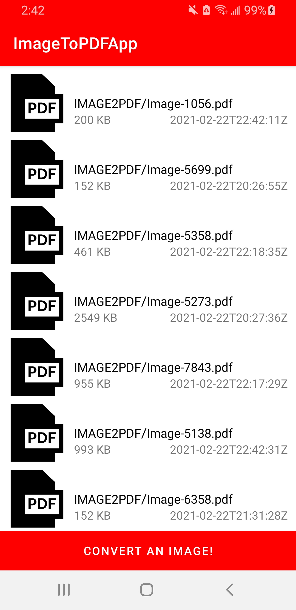
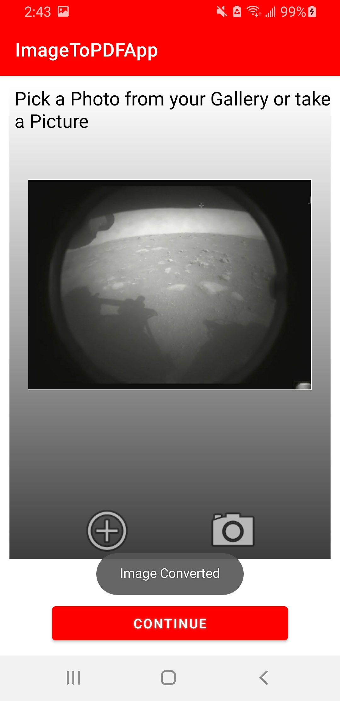

# Image-To-PDF-Android-APP
Android app for converting images to .pdf files. The user can either chose images from their gallery or take a new photo with their camera. 
 

 
 
This app is useful for scanning and submiting documents in .pdf format or it can be used for simple file management. 

## Features to come in the future
<ul>
<li>Be Able to convert word document to .pdf </li>
<li>Revese the process ( convert .pdf to image)</li>
</ul>